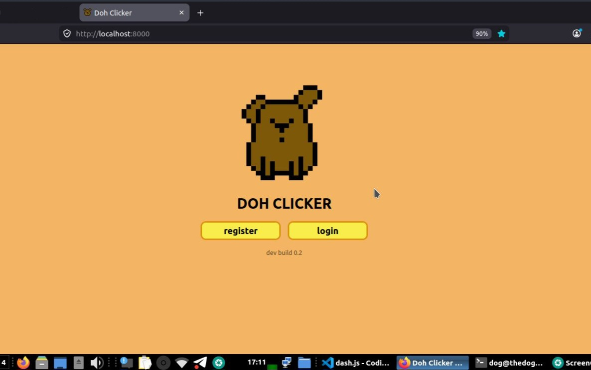
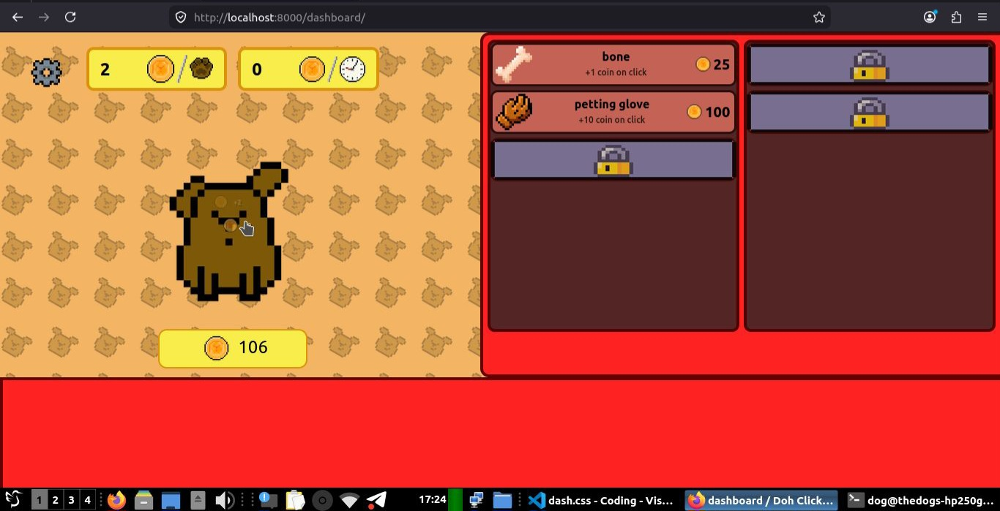
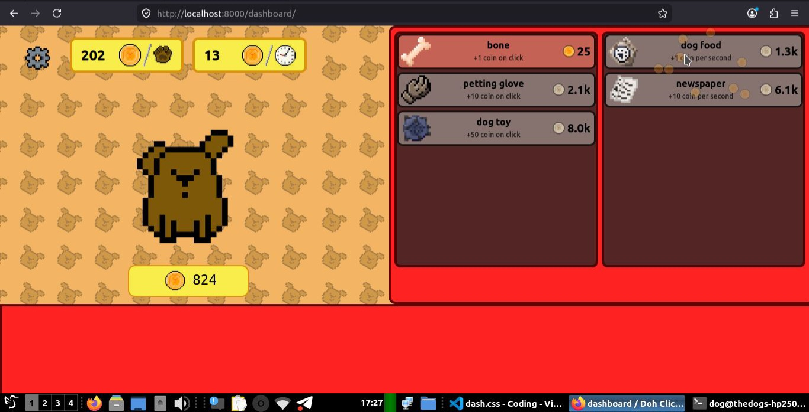

# Doh Clicker

A browser-based clicker game built with Django and pure JS.

The project was created as a learning project to practice backend web development, REST APIs, PostgreSQL, and frontend-backend synchronization to build a full web application.

## Features

- ⚡ Passive income system
- 📈 Upgrade system
- 🔊 Sound settings
- 🔄 Server synchronization
- 🛡️ Server-side validation
- 📚 REST API
- 🐘 PostgreSQL support

---

## Tech Stack

### Backend

- Python
- Django
- Django REST Framework
- PostgreSQL

### Frontend

- HTML
- CSS
- Vanilla JavaScript

### Tools

- Locust
- Swagger

---

## Screenshots

### Main page



### Dashboard




---

## Video

A full gameplay demonstration of **v0.2** is avaiable [here](https://t.me/empty_channel_00/310).

---

## 🚀 Running locally

```shell
$ git clone <repo>

$ python -m venv venv
$ source venv/bin/activate

$ pip install -r requirements.txt

$ python manage.py migrate
$ python manage.py runserver
```
---

## 📌 Status

Current version: **v0.2**

This project serves as a learning project mainly made to demonstrate Django, Django REST Framework, PostgreSQL, client-server synchronization, and basic web application architecture.